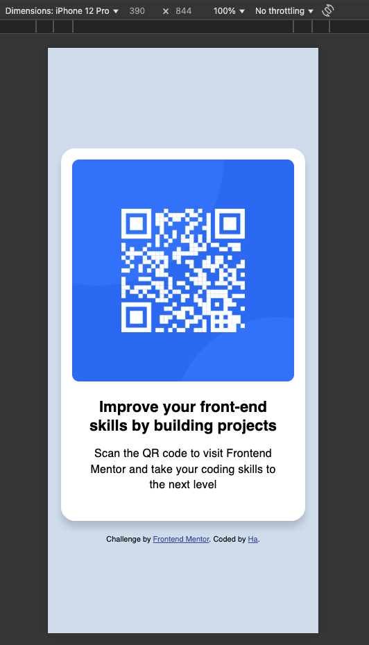

# Frontend Mentor - QR code component solution

This is a solution to the [QR code component challenge on Frontend Mentor](https://www.frontendmentor.io/challenges/qr-code-component-iux_sIO_H). Frontend Mentor challenges help you improve your coding skills by building realistic projects.

## Table of contents

- [Overview](#overview)
  - [Screenshot](#screenshot)
  - [Links](#links)
- [My process](#my-process)
  - [Built with](#built-with)
  - [What I learned](#what-i-learned)
  - [Useful resources](#useful-resources)
- [Author](#author)

## Overview

### Screenshot

### Links

- Solution URL: https://github.com/hatran-hattt/frontendmentor-qr-code-component-main.git
- Live Site URL: https://hatran-hattt.github.io/frontendmentor-qr-code-component-main

## My process

### Built with

- Semantic HTML5 markup
- CSS custom properties
- Flexbox

### What I learned

1. Layout

   - Apply flexbox (one-dimensional layout) for body & card.
   - Body flex's setting:
     flex-direction: column; // set main-axis
     align-items: center; // center cross-axis
     justify-content: center; // center main-axis
     min-height: 100vh; // 100vh stands for 100% of the viewport height(the visible part of the browser window). To have spare space in your container when working as a column you need to give your container a height or block-size. Otherwise you won't have spare space to distribute (when use justify-content)

2. Text and Typography
   - Google Font Loading
     - Include
     <link rel="preconnect" href="https://fonts.googleapis.com">
     <link rel="preconnect" href="https://fonts.gstatic.com" crossorigin>
     in your HTML <head> before your Google Fonts <link> tags. They help the browser establish an early connection to the Google Fonts servers, reducing latency.
     - Specific only font weights are used in project
   - Text style
     font-weight: 400(normal)/700(bold)
     line-height: space between lines
     letter-spacing: space between characters

### Useful resources

- [Layout](https://web.dev/learn/css/layout) - Provided insight into choosing the appropriate layout type.
- [Flexbox](https://web.dev/learn/css/flexbox) - Helped me grasp flexbox layout concepts and apply them to QR Code Card's arrangement.
- [Text and Typography](https://web.dev/learn/css/typography) - Instrumental in understanding how to style the QR Code Card's text.

## Author

- Frontend Mentor - [@hatran-hattt](https://www.frontendmentor.io/profile/hatran-hattt)
